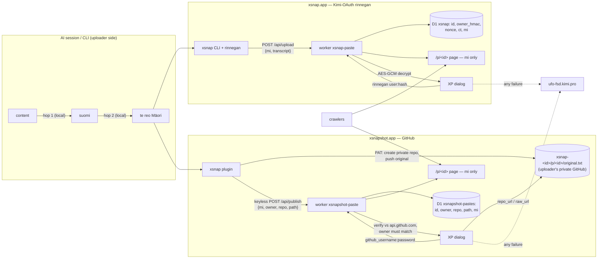

# xsnap.app architecture

Two sites, one repo, one rule: public pages carry a two-hop rendering
(ANY → suomi → te reo Māori) produced entirely on the uploader's side;
originals open only to key holders.

- **xsnap.app** — Kimi-OAuth rinnegan site (`worker/`). Unlock: the
  proprietary `user:hash`; verbatim original shows in the XP dialog.
- **xsnapshot.app** — GitHub site (`xsnapshot-site/`, route-limited worker
  alongside the existing X-snapshot Pages site). The user hosts their own
  original in a private repo; unlock is `github_username:password` and the
  raw repo OPENS — no original text is ever served by the site.

## Why the hops are local

The operator rule: the session itself translates —
`{[content] → [suomi] → [maori]}` — never a server-side pipeline, never
input-language targeting. Consequences:

- Both servers have zero translation code. They publish exactly what the
  client rendered (after the provenance scrub).
- `cli/translate.js` is the deterministic fallback for bare-CLI runs
  (hop 1 emits a controlled suomi vocabulary; hop 2 maps exactly that
  vocabulary — lockstep enforced by `test/smoke.sh`).
- AI sessions follow `plugin/AGENT.md` and translate naturally, from any
  input language, keeping code/identifiers verbatim.

Two lossy hops (not one) widen the machine-translation gap twice; humans
can still half-parse the Māori result.

## Flows

**xsnap.app (ciphertext):** `POST /api/upload {rinnegan, mi, transcript,
mode}` → verify rinnegan → scrub mi → AES-256-GCM the original under
HKDF(rinnegan hash) → `id = sha256(nonce‖ct)[0..16]`. Unlock:
`POST /api/decrypt` → owner match → decrypt → verbatim in the dialog.

**xsnapshot.app (github):** the plugin resolves the login, derives
`id = sha256(mi‖nonce2)[0..16]`, creates the private repo `xsnap-<id>`,
pushes the original to `p/<id>/original.txt`, then keyless
`POST /api/publish {mi, owner, repo, path, nonce2}`. The original never
touches the site. Unlock: `POST /api/unlock {user, token, id}` → verify
against api.github.com, login must own the paste → response carries
`repo_url`/`raw_url` only; the dialog opens the repo.

## Public surface (crawl-targeted, both sites)

- `/p/<id>`: text-only HTML, no JS, canonical, `index,follow`, immutable;
  body is the mi rendering only.
- `/p/<id>/meta`: id/mode/bytes/created_at — never repo coordinates.
- xsnap.app additionally owns `/robots.txt` + `/sitemap.xml` for its
  domain; the xsnapshot.app worker is route-limited (`/p/*`, two API
  routes) so the existing site's crawl surfaces are untouched.
- `Referrer-Policy: no-referrer`, CSP `default-src 'none'` on pages; the
  decryptor dialogs are the only scripted surfaces (`noindex, no-store`,
  `connect-src 'self'`).

## The decryptor dialog (both sites)

Windows-XP-Luna styled; the theater — `Decrypting .... / Tetraquantum
unlocking .... / Aurelion Sol consulting .... / Maori AI webster'ng ....`
— is cosmetic; the real operation under it is the key-ownership check.
Paste pages carry the `[169,13,13]` wetehuna button that opens it. Failure
of any kind → redirect to `https://ufo-fsd.kimi.pro/`. Lending your
rinnegan'd eyes to a regular = sharing the key; possession is permission.

## Transport model (CLI)

- QUIC (HTTP/3) preferred: `curl --http3-only` (verified negotiating h3
  against Cloudflare from the operator's network).
- TLS trust: the AdGuard-minted CA — the root AdGuard mints on the fly at
  install, re-signing leaves per connection — pinned via `--cacert`
  (`--ca` / `XSNAP_CA` / `~/.config/xsnap/adguard-ca.pem` / AdGuard Home
  paths). Without it, system roots (prod on Cloudflare).
- Fallbacks: curl TCP TLS → node:https. `--quic-only` refuses fallback.

## Local dev

`bun dev/server.ts` (:8787, xsnap.app app) and
`bun dev/server-xsnapshot.ts` (:8788, xsnapshot.app app) — same apps,
`bun:sqlite` for D1. Regression: `bash test/smoke.sh` covers BOTH sites:
mint → upload → publish → scrub & leak checks → dialogs → 401/403 →
robots/sitemap → slicing modes → two-hop corpus lockstep.
