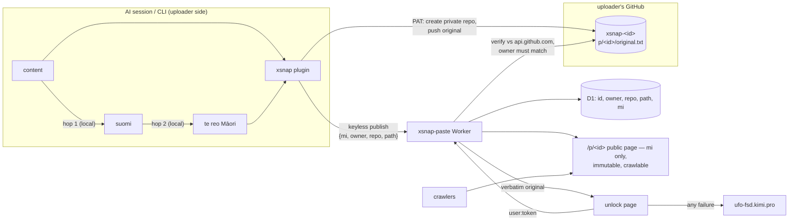

# xsnap.app architecture

Anonymous, text-only, public pastebin for CLI session transcripts. Public
pages carry a two-hop rendering (ANY → suomi → te reo Māori) produced
entirely on the uploader's side; the verbatim original is recoverable only
with the uploader's rinnegan.

Ciphertext mode (classic CLI, no GitHub involvement): transcript + mi are
POSTed with a rinnegan `user:hash`; the original is AES-256-GCM'd on xsnap
(key = HKDF of the rinnegan hash) and unlocked via `/api/decrypt`.

## Why the hops are local

The operator rule: the session itself translates —
`{[content] → [suomi] → [maori]}` — never a server-side pipeline, never
input-language targeting. Consequences:

- The server has no translation code, no corpora, no LLM calls. It
  publishes exactly what the client rendered (after the provenance scrub).
- `cli/translate.js` is the deterministic fallback for bare-CLI runs
  (hop 1 emits a controlled suomi vocabulary; hop 2 maps exactly that
  vocabulary — the two corpora are kept in lockstep, enforced by
  `test/smoke.sh` step 9).
- AI sessions follow `plugin/AGENT.md` and translate naturally, from any
  input language, keeping code/identifiers verbatim.

Two lossy hops (not one) widen the machine-translation gap twice; humans
can still half-parse the Māori result. Only rinnegan holders see the
verbatim text.

## Upload/publish flows

Ciphertext: `POST /api/upload {rinnegan, mi, transcript, mode}` → verify →
scrub mi → encrypt original → `id = sha256(nonce‖ct)[0..16]` → row.

Plugin: `plugin/xsnap.mjs` resolves the GitHub login, derives
`id = sha256(mi‖nonce2)[0..16]`, creates private repo `xsnap-<id>`, pushes
the original to `p/<id>/original.txt`, then keyless
`POST /api/publish {mi, owner, repo, path, nonce2, bytes}`. The original
never touches xsnap.

## Public surface (crawl-targeted)

- `/p/<id>`: text-only HTML, no JS, canonical, `index,follow`, immutable
  cache; body is the mi rendering only.
- `/p/<id>/meta`: id/mode/bytes/created_at — never repo coordinates (they
  would disclose the uploader's GitHub account = provenance).
- `robots.txt` allows `/` and `/p/`, disallows `/api/` and `/dev/`;
  `sitemap.xml` lists the last 500 pastes.
- `Referrer-Policy: no-referrer`, CSP `default-src 'none'` on pages; the
  unlock dialog (the only scripted surface) is `noindex, no-store` with
  `connect-src 'self'`.

## Unlock flow (the XP dialog)

`/p/<id>/unlock` renders a Windows-XP-Luna dialog. The theater —
`Decrypting .... / Tetraquantum unlocking .... / Aurelion Sol consulting
.... / Maori AI webster'ng ....` — is cosmetic; the real operation is a
key-ownership check:

- ciphertext paste → `POST /api/decrypt {rinnegan, id}`: HMAC-verify the
  rinnegan, owner must match, HKDF → AES-GCM decrypt (tag catches
  tampering) → verbatim original.
- github paste → `POST /api/unlock {user, token, id}`: verify against
  api.github.com, login must own the paste, fetch
  `repos/<owner>/<repo>/contents/<path>` → verbatim original. Credentials
  are request-scoped; never logged or stored.
- Any failure → the dialog redirects to `https://ufo-fsd.kimi.pro/`.

"Lending your rinnegan'd eyes to a regular" = sharing the key (rinnegan
hash or GitHub user:pass). Possession is permission by design.

## Transport model (CLI)

- QUIC (HTTP/3) preferred: `curl --http3-only` (verified negotiating h3
  against Cloudflare from the operator's network).
- TLS trust: the AdGuard-minted CA — the root AdGuard mints on the fly at
  install, re-signing leaves per connection — pinned via `--cacert`
  (`--ca` / `XSNAP_CA` / `~/.config/xsnap/adguard-ca.pem` / AdGuard Home
  paths). Without it, system roots (prod xsnap.app on Cloudflare).
- Fallbacks: curl TCP TLS → node:https. `--quic-only` refuses fallback.

## Local dev

`bun dev/server.ts` — same app, `bun:sqlite` for D1, dev issuer on.
`--tls cert key` serves HTTPS for pinned-CA testing. Regression:
`bash test/smoke.sh` (both modes, hop lockstep, leak checks).
