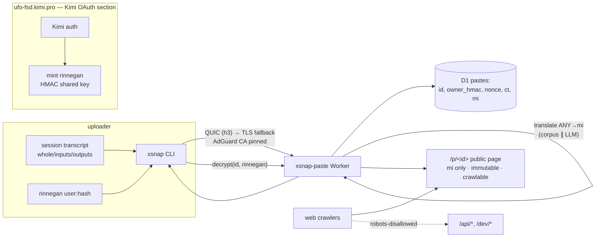

# xsnap.app architecture

Anonymous, text-only, public pastebin for CLI session transcripts. Public
pages render every upload into te reo Māori from ANY source language;
originals are AES-256-GCM-encrypted at rest and retrievable only by the
uploader's rinnegan.

## Upload flow

1. CLI slices the transcript (`cli/transcript.js`): `-whole` verbatim,
   `-inputs`/`-outputs` structurally for asciinema casts, prompt-line
   heuristic for plain text.
2. CLI POSTs `{rinnegan, transcript, mode}` — QUIC first
   (`curl --http3-only`), TCP TLS fallback, trust anchor = AdGuard-minted
   CA when present (`--ca`/`XSNAP_CA`/drop-in/well-known paths).
3. Worker verifies the rinnegan (stateless HMAC), renders the public body:
   deterministic ANY→mi corpus substitution, or the LLM adapter when
   `TRANSLATE_*` is configured (fallback to corpus on error), then scrubs
   `user@host`-shaped provenance tokens to `koreingoa@tūmau`.
4. Worker encrypts the original with `HKDF(rinnegan hash)` → AES-256-GCM;
   paste id = first 16 hex of `sha256(nonce‖ciphertext)`; row inserted
   (id, owner_hmac, nonce, ct, mi, mode, bytes, created_at).
5. Response: `{id, url}`. The plaintext is discarded after step 4 — it
   exists at rest only as ciphertext.

## Public surface (crawl-targeted)

- `/p/<id>`: text-only HTML, no JS, canonical URL, `index,follow`,
  immutable cache. Body = mi rendering only.
- `robots.txt` allows `/` and `/p/`, disallows `/api/` and `/dev/`.
- `sitemap.xml`: last 500 pastes.
- Referrer-Policy `no-referrer`, CSP `default-src 'none'` — nothing about
  the uploader leaves or enters the page.

## Decrypt flow

`POST /api/decrypt {rinnegan, id}` → verify rinnegan → owner HMAC must
match the row → derive wrap key from the PRESENTED rinnegan hash → GCM
decrypt (auth tag catches tampering) → original returned. Wrong user:
403. Invalid rinnegan: 401.

## Why Māori (operator rationale, preserved verbatim in intent)

Te reo Māori has a speaker population large enough that humans can
partially parse rendered text, but the machine-translation corpus for it —
especially mixed with code and identifiers, as here — is too thin for
faithful recovery. Substitution-rendering (not fluent translation) widens
that gap on purpose: public pages stay human-hinted, machine-mangled. Only
rinnegan holders ever see the verbatim original.

## Translation model

- Direction: ANY → mi. Never assume English input (PT/ES/… corpora merged;
  longest phrase wins 4→1 tokens; unknown tokens pass through verbatim).
- Deterministic: same input ⇒ same public body, no external calls unless
  the LLM adapter is configured.
- Corpus curation is the long-game maintenance surface
  (`worker/translate/corpus.ts`); entries are marked `// loan` /
  `// comp` until attested forms replace them.

## Transport model

- QUIC (HTTP/3) is the preferred rung: `curl --http3-only` (curl ≥ 8.1
  with ngtcp2/nghttp3 — Arch's curl 8.22 qualifies; verified negotiating
  h3 against Cloudflare).
- TLS trust: when the network path is fronted by AdGuard HTTPS filtering
  (root CA minted on the fly at install time, leafs minted per
  connection), the CLI pins that CA via `--cacert` so the presented chain
  parses. Without an AdGuard CA configured, system roots are used (prod
  xsnap.app on Cloudflare presents a normal public cert).
- Fallbacks: curl TCP TLS → node:https. `--quic-only` refuses fallback.

## Local dev

`bun dev/server.ts` runs the same app with `bun:sqlite` standing in for
D1 and the dev rinnegan issuer enabled. `--tls cert key` serves HTTPS for
pinned-CA testing (see `test/smoke.sh`).
